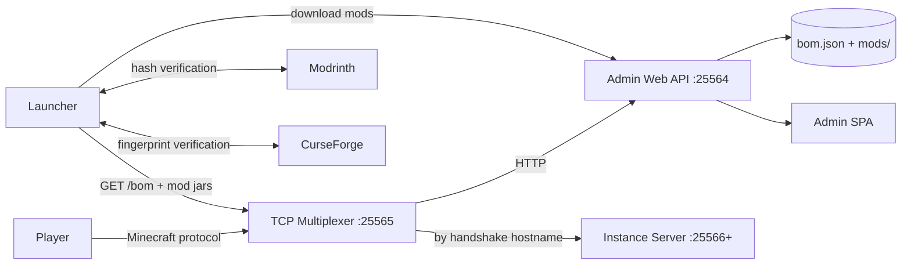
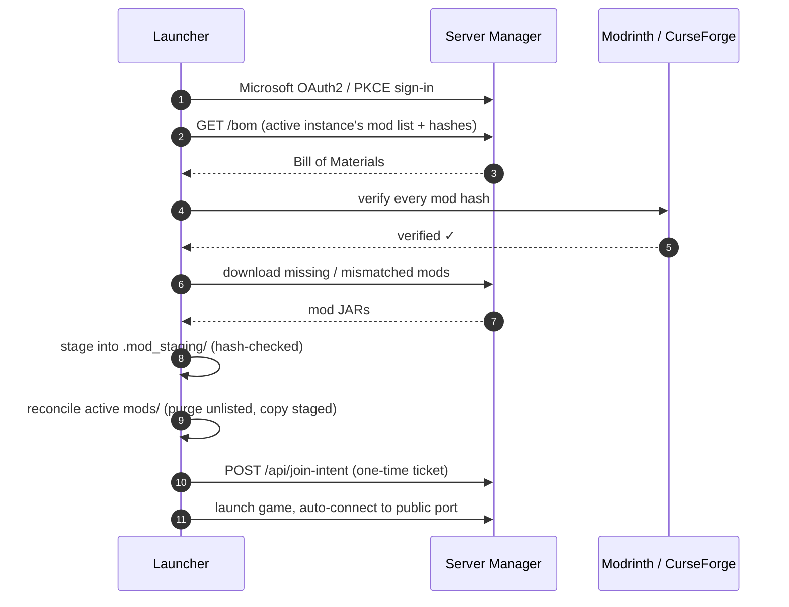

<p align="center">
  
</p>

<p align="center">
  <strong>Self-hosted Minecraft server manager &amp; companion launcher</strong> — run your
  own modded Minecraft server with a full admin dashboard, and let your players
  join with a one-click launcher that installs the <em>exact</em> mods your server runs,
  verified against Modrinth &amp; CurseForge on every launch.
</p>

<p align="center">
  
  
  
  
  
  
</p>

> [!NOTE]
> This is the **Rust rewrite** of Zircon (formerly a Java 21 / JavaFX / Javalin /
> Netty codebase). The complete Java reference implementation is preserved on the
> [`legacy-java`](../../tree/legacy-java) branch. The migration plan lives in
> [`RUST_AGENT_PLAN.md`](RUST_AGENT_PLAN.md).

> [!IMPORTANT]
> **NOT AN OFFICIAL MINECRAFT PRODUCT. NOT APPROVED BY OR ASSOCIATED WITH MOJANG
> STUDIOS OR MICROSOFT.** "Minecraft" is a trademark of Mojang Synergies AB.
> This project does **not** bundle, redistribute, or modify any part of the game.
> You must own Minecraft and sign in with your own Microsoft account. See the
> [Legal & EULA](#-legal--eula-compliance) section.

---

## ✦ Features

### Server Manager (`crates/zircon-server`)

| | Feature | What it does |
|---|---|---|
| ▣ | **Multi-instance** | Run fully isolated Minecraft servers — each with its own world, loader, mods, and BOM under `server-data/instances/<id>/`. |
| ⇄ | **Single-port multiplexer** | One public port (default `25565`) smartly routes *both* Minecraft traffic and HTTP — no firewall gymnastics. |
| ◈ | **Join gate** | The TCP multiplexer parses the Minecraft handshake + login start, requires a one-time pre-join ticket, and disconnects vanilla clients with a framed "Zircon Client Required" message. |
| ▤ | **Bill of Materials (BOM)** | The authoritative mod list your server publishes. Clients install **exactly** what the server runs. |
| ⚒ | **Mod management** | Search & install mods straight from Modrinth and CurseForge, upload your own JARs, and get SHA-1 / fingerprint-verified entries with rich metadata (title, author, icon). |
| ⇕ | **Version switching** | Change Minecraft / loader versions per instance and auto-re-resolve every installed mod for compatibility. |
| ♟ | **Player tools** | Live player tracking, whitelist, ops, bans — applied instantly on a running server, offline-safe otherwise. |
| ⌨ | **Live console** | Stream the server console in real time over WebSocket and run commands from the browser. |
| ◫ | **Backups** | LZ4-compressed tar snapshots on a schedule (`daily`/`weekly`/`monthly`) with retention pruning and one-click restore. |
| ☾ | **Idle shutdown** | Per-instance toggle that shuts a server down gracefully after a configurable window with no players online — the launcher wakes it automatically on the next join, so resources are only used while people are playing. |
| ▮ | **System stats** | CPU, RAM, and disk telemetry with a live history graph. |
| ⚔ | **Admin auth** | BCrypt users + JWT-secured admin API with a bundled single-page dashboard and a generated first-run password. |

### Companion Launcher (`crates/zircon-launcher`)

| | Feature | What it does |
|---|---|---|
| ☑ | **Mandatory Microsoft sign-in** | Full OAuth2 + PKCE flow (browser login via a dynamic localhost callback) with silent token refresh. There is **no offline/unauthenticated mode** for online play — you must own Minecraft. |
| ↻ | **Dynamic mod staging** | On every launch the client downloads mods into a staging area (`.mod_staging/`), verifies hashes against Modrinth/CurseForge, reconciles your active `mods/` folder — purging stale mods automatically. |
| ☰ | **Saved servers** | Persistent server list (`~/.mcmanager/servers.json`), most-recently-played first, plus a curated recommendations panel. |
| ☺ | **Skin customizer** | 64×64 PNG skins with a WebGL 3D preview (Three.js), history gallery, and Mojang fetch/upload integration. Stored at `~/.mcmanager/skins/active_skin.png`. |
| ◐ | **Offline instances** | Create and launch single-player instances with their own mods, shaderpacks, and texture packs. |
| ⚙ | **Launcher settings** | RAM slider. Mod downloads are always hash-verified against Modrinth/CurseForge (no opt-out). |
| ► | **One-click join** | Fetches the server BOM, resolves the exact Minecraft + loader runtime (Fabric/Quilt/Forge/NeoForge), registers the pre-join ticket, and auto-connects in fullscreen. |
| ⏻ | **Auto-wake asleep servers** | If a Zircon server is sleeping (idle shutdown), PLAY wakes it via the wrapper and waits for it to come online before connecting. |
| □ | **Per-server isolation** | Every server gets its own game directory (`~/.zircon/instances/<host>_<port>/`) so mods and configs never mix. |

---

## ◆ Architecture



**How a player joins:**



---

## ► Quick Start

### Prerequisites

- **Rust toolchain** (edition 2021; MSVC on Windows, `cargo` + `rustc`)
- **Node.js 18+** (for the launcher's Vue 3 frontend)
- A **Minecraft account** (Java Edition) — required for the client, enforced via Microsoft sign-in
- **No Azure setup needed** — the launcher bundles a Microsoft client ID, so Microsoft sign-in works out of the box (power users can override it via the `MC_MANAGER_CLIENT_ID` env var or `~/.mcmanager/client_id.txt`)

### 1. Build

```bash
cargo build --workspace
```

### 2. Run the server manager

```bash
cargo run -p zircon-server
```

- On first run, the server prints the **initial admin password** to the console.
- Open the admin dashboard at **http://localhost:25564** (or through the public port at `http://<host>:25565`).
- Create an instance, accept the EULA, start the server — done. ✓

### 3. Run the companion launcher

```bash
cd crates/zircon-launcher
npx @tauri-apps/cli dev          # dev mode (Vite hot reload)
# or run the release binary:
cargo tauri build --no-bundle
```

The launcher ships with a bundled Microsoft client ID, so sign-in needs no setup. To use your own Azure app registration instead, set `MC_MANAGER_CLIENT_ID` or write the client ID to `~/.mcmanager/client_id.txt` (never committed).

Sign in with Microsoft, pick a server from your saved list, and hit **PLAY** — the
launcher syncs the exact mods the server publishes, then drops you straight in.

> **Server data lives in `server-data/` (gitignored)** — worlds, logs, the server
> JAR, and any API keys never reach the repository.

---

## ▦ Project Structure

```text
zircon/
├── Cargo.toml                        # Workspace root manifest
├── crates/
│   ├── zircon-core/                  # Shared domain: models, hashes, archives,
│   │                                 #   mod metadata, Modrinth/CurseForge clients
│   ├── zircon-server/                # Server manager daemon
│   │   ├── multiplexer/              #   TCP multiplexer + join gate
│   │   ├── process/                  #   Minecraft subprocess + console/players
│   │   ├── services/                 #   BOM, mods, packs, backups, scheduler
│   │   ├── web/                      #   Axum admin API + bundled SPA
│   │   └── assets/web/               #   Admin dashboard (Vue, embedded)
│   └── zircon-launcher/              # Tauri v2 companion launcher
│       ├── src/                      #   auth, launch, sync, skin, commands
│       └── ui/                       #   Vue 3 + Tailwind + Three.js frontend
└── server-data/                      # Runtime data — GITIGNORED
    └── instances/<id>/               #   Per-server: bom.json, mods/, server/
```

---

## ⚙ Tech Stack

| Layer | Technology |
|---|---|
| Language | Rust 2021 (tokio async runtime) |
| Build | Cargo workspace (resolver 2) |
| Server API | Axum 0.7 (REST + WebSockets) |
| Networking | tokio (TCP multiplexer, VarInt framing) |
| Launcher Shell | Tauri 2 + WebView2 |
| Launcher UI | Vue 3 + Vite + Tailwind CSS + Three.js |
| Auth | Microsoft OAuth2 + PKCE (client) · JWT + BCrypt (admin) |
| Data | serde/serde_json, `server.properties` editor, per-instance files |
| Archival | LZ4 (`lz4_flex`) + tar |
| Tests | cargo test (219 unit/integration tests across the workspace) |

---

## ⚖ Legal & EULA Compliance

**This project is a third-party tool and is not affiliated with Mojang Studios or
Microsoft in any way.** It is not an official Minecraft product and has not been
approved by or associated with Mojang or Microsoft.

The project is designed to respect the [Minecraft EULA](https://aka.ms/MinecraftEULA):

| Requirement | How Zircon complies |
|---|---|
| **You must own Minecraft** | The launcher requires a real Microsoft account with a Minecraft license. No offline / unauthenticated mode exists for online play. |
| **No redistribution of the game** | No Minecraft client/server JARs, assets, or code are bundled in this repository. `server-data/` (which holds the server JAR) is gitignored. |
| **No monetization** | There are no paid features, ads, or pay-to-access mechanics. You may not charge players to access your server through this tool. |
| **EULA acknowledgment** | Server operators must explicitly accept the EULA in the admin UI before an instance can start. |
| **Use of official endpoints** | The launcher/wrapper download version manifests, assets, and server JARs from Mojang's official endpoints on your behalf, for your own use. |

> **You are responsible for your own compliance.** Running a server, installing
> mods, and playing Minecraft remain subject to the EULA and Mojang's
> [Brand Guidelines](https://www.minecraft.net/en-us/usage-guidelines). If in
> doubt, review the EULA before publishing your server publicly.

---

## © License

The code in this repository is licensed under the [MIT License](LICENSE).
Minecraft itself, its assets, and its trademarks remain the property of Mojang
Studios / Microsoft — see the [Legal & EULA Compliance](#-legal--eula-compliance)
section above.

---

## ♥ Acknowledgments

- [Modrinth](https://modrinth.com) & [CurseForge](https://www.curseforge.com) for their public APIs
- [Mojang Studios](https://www.minecraft.net) for Minecraft — this project is a fan-made utility, not an official product
- The Rust, tokio, Axum, Tauri, Vue, and Three.js communities for the foundations this project is built on
