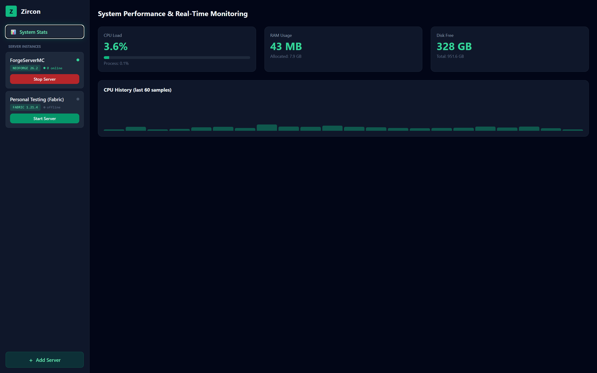
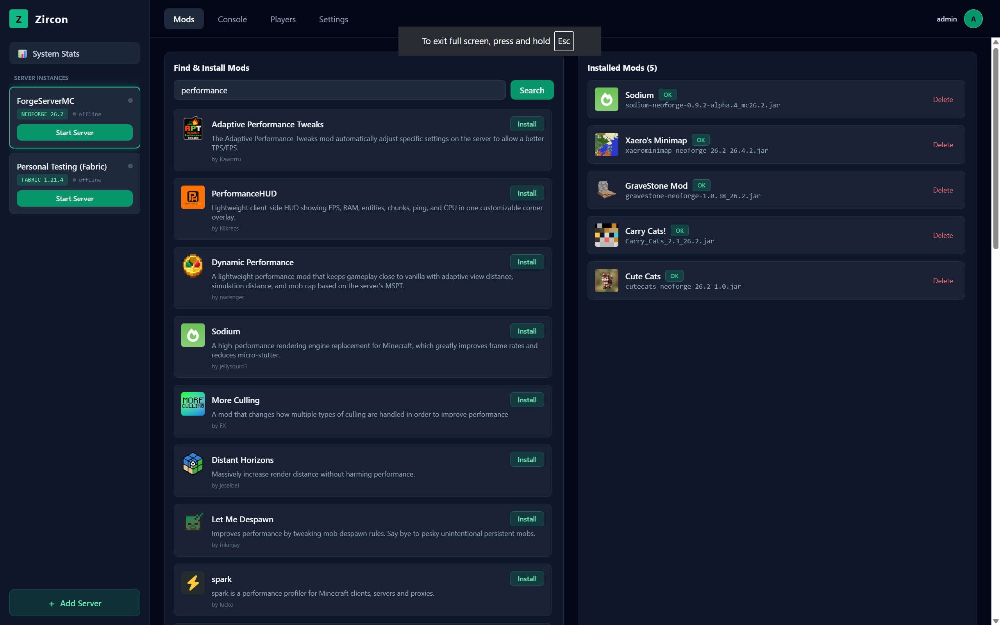
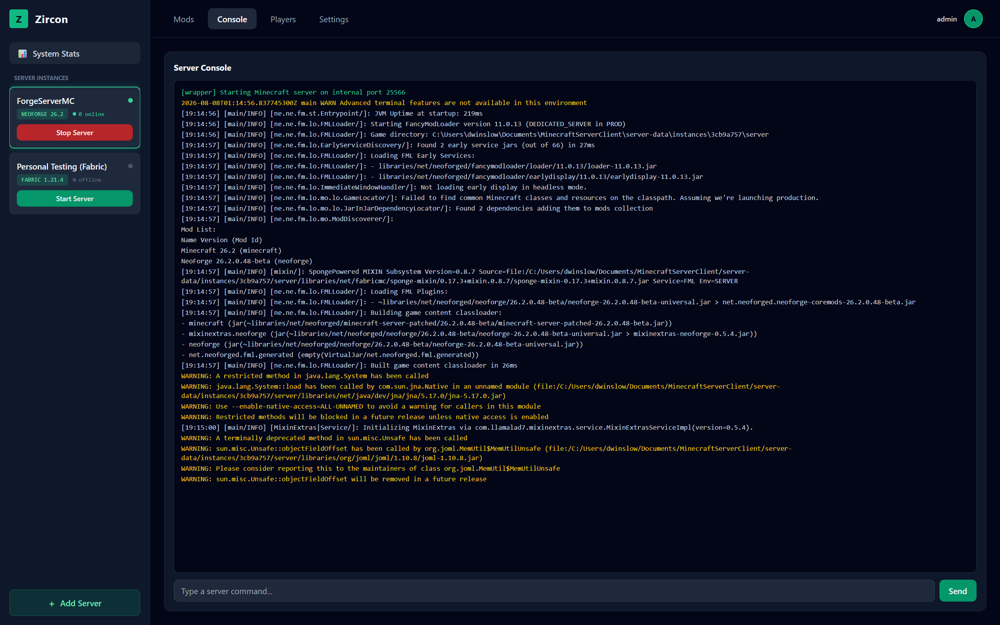
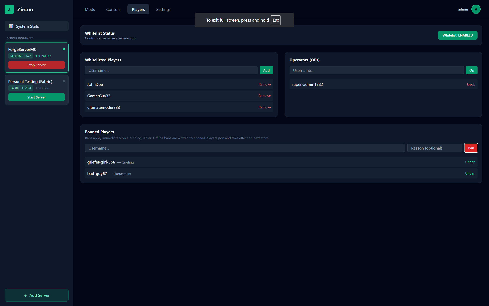
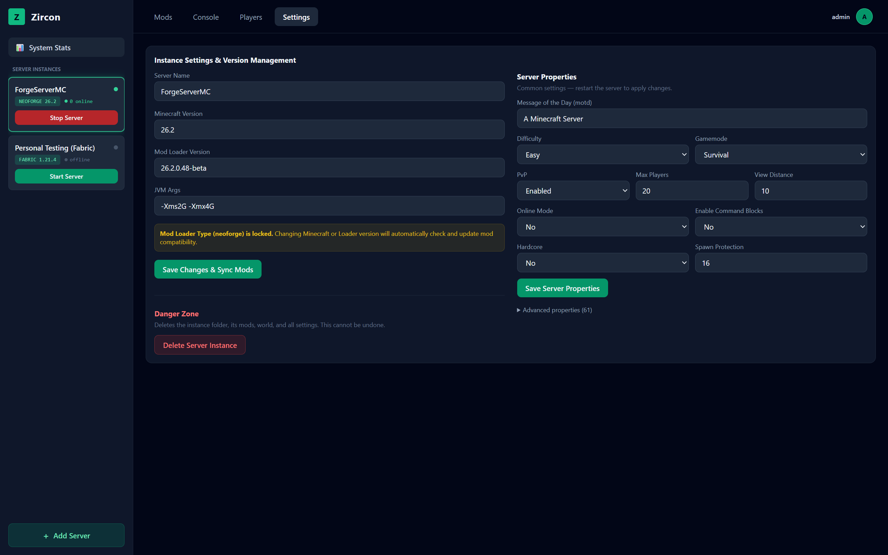
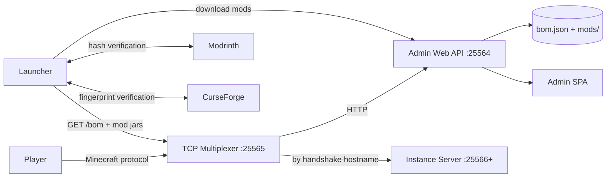
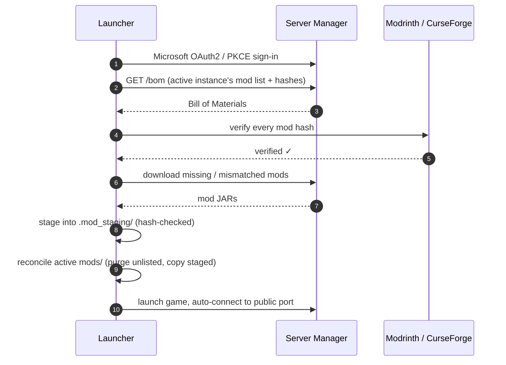

# ⚡ Zircon — Self-Hosted Minecraft Server Manager & Companion Launcher


> **Run your own modded Minecraft server with a full admin dashboard, and let your
> players join with a one-click launcher that installs the *exact* mods your server
> runs — verified against Modrinth & CurseForge on every launch.**

---

> [!IMPORTANT]
> **NOT AN OFFICIAL MINECRAFT PRODUCT. NOT APPROVED BY OR ASSOCIATED WITH MOJANG
> STUDIOS OR MICROSOFT.** "Minecraft" is a trademark of Mojang Synergies AB.
> This project does **not** bundle, redistribute, or modify any part of the game.
> You must own Minecraft and sign in with your own Microsoft account. See the
> [Legal & EULA](#-legal--eula-compliance) section.

---

## ✨ Features

### 🖥️ Server Manager (`server-manager`)

| | Feature | What it does |
|---|---|---|
| 🏗️ | **Multi-instance** | Run fully isolated Minecraft servers — each with its own world, loader, mods, and BOM under `server-data/instances/<id>/`. |
| 🔌 | **Single-port multiplexer** | One public port (default `25565`) smartly routes *both* Minecraft traffic and HTTP — no firewall gymnastics. |
| 📦 | **Bill of Materials (BOM)** | The authoritative mod list your server publishes. Clients install **exactly** what the server runs. |
| 🔍 | **Mod management** | Search & install mods straight from Modrinth and CurseForge, upload your own JARs, and get SHA-1 / fingerprint-verified entries with rich metadata (title, author, icon). |
| 🧯 | **Version switching** | Change Minecraft / loader versions per instance and auto-re-resolve every installed mod for compatibility. |
| 🎮 | **Player tools** | Live player tracking, whitelist, ops, bans — applied instantly on a running server, offline-safe otherwise. |
| 🖥️ | **Live console** | Stream the server console in real time over WebSocket and run commands from the browser. |
| 📊 | **System stats** | CPU, RAM, and disk telemetry with a live history graph. |
| 🔐 | **Admin auth** | JWT-secured admin API + bundled single-page dashboard with a generated first-run password. |

### 🚀 Companion Launcher (`client-launcher`)

| | Feature | What it does |
|---|---|---|
| 👤 | **Mandatory Microsoft sign-in** | Full OAuth2 + PKCE flow (device-agnostic browser login) with silent token refresh. There is **no offline/unauthenticated mode** — you must own Minecraft. |
| 🔄 | **Dynamic mod staging** | On every launch the client downloads mods into a staging area (`.mod_staging/`), verifies hashes against Modrinth/CurseForge, reconciles your active `mods/` folder — purging stale mods automatically. |
| 💾 | **Saved servers** | Persistent server list (`~/.mcmanager/servers.json`), most-recently-played first, plus a curated recommendations panel. |
| 👕 | **Skin customizer** | Upload a 64×64 PNG skin, previewed live and stored at `~/.mcmanager/skins/active_skin.png`. |
| ⚙️ | **Launcher settings** | RAM slider, strict hash verification toggle, and trust-direct-mods toggle. |
| ⚡ | **One-click join** | Fetches the server BOM, resolves the exact Minecraft + loader runtime (Forge/NeoForge supported), and auto-connects in fullscreen. |
| 🧩 | **Per-server isolation** | Every server gets its own game directory (`~/.zircon/instances/<host>_<port>/`) so mods and configs never mix. |

---

## 🖼️ Screenshots

<!-- Drop your own captures in docs/screenshots/ and replace the filenames below. -->
> The admin dashboard ships as a bundled single-page app. Placeholders below.

| 📊 System Stats | 🧩 Mods |
|---|---|
|  |  |

| 🖥️ Console | 👥 Players |
|---|---|
|  |  |

| ⚙️ Settings |
|---|
|  |

---

## 🏗️ Architecture



**How a player joins:**



---

## 🚀 Quick Start

### Prerequisites

- **JDK 21+** (project targets Java 21 bytecode)
- A **Minecraft account** (Java Edition) — required for the client, enforced via Microsoft sign-in
- A Microsoft **Azure app registration** with redirect URI `http://localhost:8080/callback` for the launcher's client ID

### 1. Build

```bash
./gradlew build          # Linux / macOS / WSL
gradlew.bat build        # Windows
```

### 2. Run the server manager

```bash
./gradlew :server-manager:run
```

- On first run, the wrapper prints the **initial admin password** to the console.
- Open the admin dashboard at **http://localhost:25564** (or through the public port at `http://<host>:25565`).
- Create an instance, accept the EULA, start the server — done. ✅

### 3. Run the companion launcher

Provide your Azure client ID either per launch or via a local file:

```bash
# Option A: pass it per launch
./gradlew :client-launcher:run --args="--clientId=<YOUR_AZURE_CLIENT_ID>"

# Option B: store it once (never committed)
echo "<YOUR_AZURE_CLIENT_ID>" > ~/.mcmanager/client_id.txt
```

Sign in with Microsoft, pick a server from your saved list, and hit **PLAY** — the
launcher syncs the exact mods the server publishes, then drops you straight in.

> **Server data lives in `server-data/` (gitignored)** — worlds, logs, the server
> JAR, and any API keys never reach the repository.

---

## 📂 Project Structure

```text
mc-manager/
├── shared-core/                  # Shared models, providers & utilities
│   ├── api/                      #   Modrinth + CurseForge API clients
│   ├── crypto/                   #   SHA-1, MurmurHash3 (CurseForge fingerprints)
│   ├── model/                    #   BillOfMaterials, ModEntry, InstanceConfig, ...
│   └── mod/                      #   Mod metadata extraction from JARs
├── server-manager/               # The server wrapper
│   ├── instance/                 #   Isolated multi-instance lifecycle
│   ├── multiplexer/              #   Netty TCP multiplexer (HTTP + Minecraft)
│   ├── process/                  #   Minecraft subprocess + console/player tracking
│   ├── service/                  #   BOM, mod management, config, metrics
│   ├── web/                      #   Javalin admin API + controllers
│   └── src/main/resources/web/   #   Bundled admin SPA (stats, mods, console, ...)
├── client-launcher/              # JavaFX companion launcher
│   ├── auth/                     #   Microsoft OAuth2 + PKCE
│   ├── launch/                   #   Classpath resolution, runners, installers
│   ├── sync/                     #   Dynamic mod staging & reconciliation
│   ├── model/                    #   Saved server persistence
│   ├── skin/                     #   Custom skin storage
│   └── ui/                       #   Sidebar UI + controller
└── server-data/                  # Runtime data — GITIGNORED
    └── instances/<id>/           #   Per-server: bom.json, mods/, server/
```

---

## 🛠️ Tech Stack

| Layer | Technology |
|---|---|
| Language | Java 21 (virtual threads) |
| Build | Gradle 9.6 multi-module |
| Client UI | JavaFX 25 + AtlantaFX (Primer Dark) |
| Web API | Javalin 6 |
| Networking | Netty 4.1 (TCP multiplexer) |
| Auth | Microsoft OAuth2 + PKCE (client) · JWT + BCrypt (admin) |
| Data | Gson (JSON), `server.properties` editor, per-instance files |
| Tests | JUnit 5 |

---

## 🔐 Security & Secrets

- **No secrets in the repo.** `server-data/`, `client_id.txt`, `.env`, and `*.key`
  are gitignored; the committed Azure client ID is a placeholder (`REPLACE_WITH_AZURE_CLIENT_ID`).
- Your real client ID is read from `~/.mcmanager/client_id.txt` or `--clientId=` at runtime.
- Admin API routes are JWT-protected; admin passwords are BCrypt-hashed.
- Mod downloads are verified against Modrinth / CurseForge hashes; strict mode
  aborts the launch if anything fails verification.
- CurseForge API keys are read from the server config (or `-Dmcmanager.curseforgeApiKey`), never hardcoded.

---

## ⚖️ Legal & EULA Compliance

**This project is a third-party tool and is not affiliated with Mojang Studios or
Microsoft in any way.** It is not an official Minecraft product and has not been
approved by or associated with Mojang or Microsoft.

The project is designed to respect the [Minecraft EULA](https://aka.ms/MinecraftEULA):

| Requirement | How Zircon complies |
|---|---|
| **You must own Minecraft** | The launcher requires a real Microsoft account with a Minecraft license. **No offline / unauthenticated mode exists** — this was deliberately removed. |
| **No redistribution of the game** | No Minecraft client/server JARs, assets, or code are bundled in this repository. `server-data/` (which holds the server JAR) is gitignored. |
| **No monetization** | There are no paid features, ads, or pay-to-access mechanics. You may not charge players to access your server through this tool. |
| **EULA acknowledgment** | Server operators must explicitly accept the EULA in the admin UI before an instance can start. |
| **Use of official endpoints** | The launcher/wrapper download version manifests, assets, and server JARs from Mojang's official endpoints on your behalf, for your own use. |

> **You are responsible for your own compliance.** Running a server, installing
> mods, and playing Minecraft remain subject to the EULA and Mojang's
> [Brand Guidelines](https://www.minecraft.net/en-us/usage-guidelines). If in
> doubt, review the EULA before publishing your server publicly.

---

## 🗺️ Status & Roadmap

**Current status:** active development — the core loop (server admin → BOM → client
sync → launch) is working end-to-end and tested against recent Minecraft + NeoForge
versions.

## 📄 License

The code in this repository is licensed under the [MIT License](LICENSE).
Minecraft itself, its assets, and its trademarks remain the property of Mojang
Studios / Microsoft — see the [Legal & EULA Compliance](#-legal--eula-compliance)
section above.

---

## 🙏 Acknowledgments

- [Modrinth](https://modrinth.com) & [CurseForge](https://www.curseforge.com) for their public APIs
- [Mojang Studios](https://www.minecraft.net) for Minecraft — this project is a fan-made utility, not an official product
- The JavaFX, Javalin, and Netty communities for the excellent foundations this project is built on
