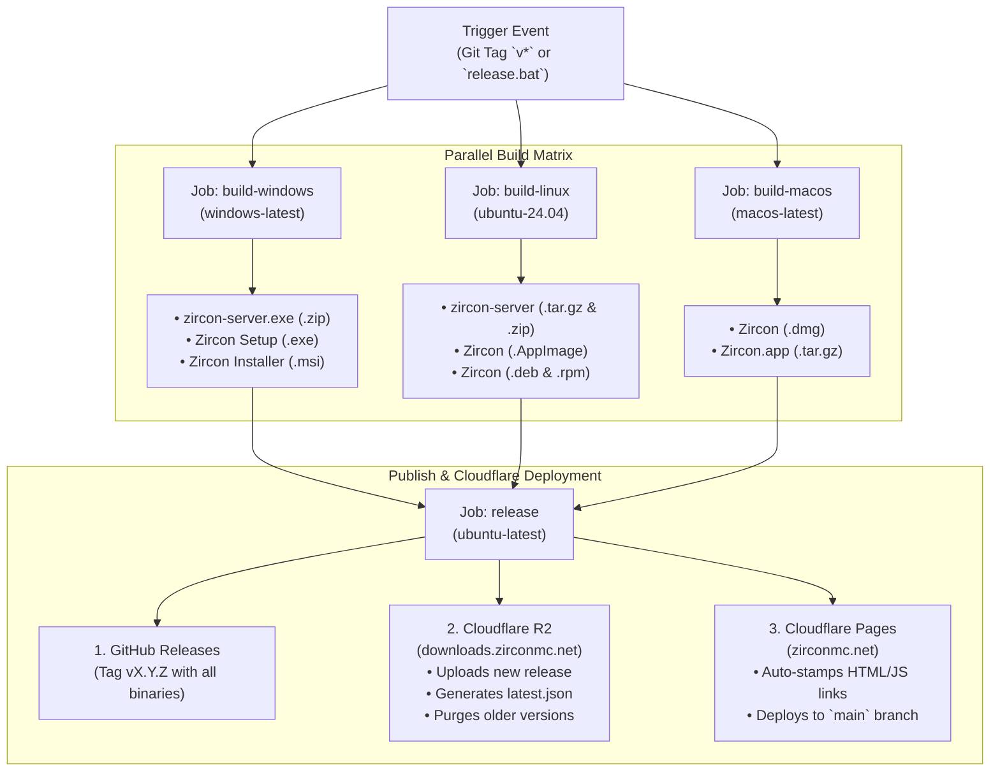

# Zircon GitHub Actions CI/CD Pipeline Guide
**Workflow File**: [`.github/workflows/build.yml`](file:///.github/workflows/build.yml)  
**Deployment Scripts**: [`scripts/ci_deploy_cloudflare.py`](file:///scripts/ci_deploy_cloudflare.py), [`scripts/sync-version.ps1`](file:///scripts/sync-version.ps1)  
**One-Click Trigger Script**: [`release.bat`](file:///release.bat)  
**Secrets Configuration**: [`docs/ci-secrets-setup.md`](file:///docs/ci-secrets-setup.md)  
**Audience**: Future AI coding agents and core developers maintaining the Zircon Platform.

---

## 1. Overview & Architecture

The Zircon GitHub Actions pipeline automates the end-to-end multi-platform build, binary packaging, digital signing, release publishing, Cloudflare R2 asset hosting, and Cloudflare Pages static site deployment.

Whenever a version tag matching `v*` (e.g. `v0.4.8`, `v0.4.9`) is pushed to GitHub or manually triggered via `workflow_dispatch`, the pipeline compiles native binaries for **Windows (x86_64)**, **Linux (x86_64)**, and **macOS (Apple Silicon & Intel)** simultaneously in parallel runner environments.



---

## 2. What the Pipeline Does

### A. Parallel Matrix Compilation
1. **Windows Runner (`windows-latest`)**:
   - Compiles the release binary for `zircon-server`.
   - Packages `zircon-server-windows-x86_64.zip` including:
     - `zircon-server.exe`
     - `start-server.bat` (launch wrapper)
     - `README.txt` (administrator guide)
     - `LICENSE` (BSL 1.1)
   - Builds Tauri launcher frontend (`npm run build`) and invokes `@tauri-apps/cli build --bundles nsis,msi`.
   - Produces NSIS installer (`.exe`) and WiX installer (`.msi`).
   - If `AZURE_KEY_VAULT_URI` credentials exist in secrets, signs Windows binaries; otherwise produces clean unsigned builds.

2. **Linux Runner (`ubuntu-24.04`)**:
   - Built on Ubuntu 24.04 to guarantee glibc 2.38+ and GCC 14 compatibility for modern ONNX Runtime (`ort v2.0.0-rc.13`).
   - Compiles the release binary for `zircon-server`.
   - Packages `zircon-server-linux-x86_64.tar.gz` and `.zip` including:
     - `zircon-server` (executable `chmod +x`)
     - `start-server.sh` (POSIX launcher)
     - `zircon-server.service` (systemd unit with OOM hardening)
     - `README.txt` & `LICENSE`
   - Builds Tauri launcher producing universal `.AppImage`, Debian/Ubuntu `.deb`, and Fedora/RHEL `.rpm`.

3. **macOS Runner (`macos-latest`)**:
   - Builds Tauri launcher frontend and compiles the release binary.
   - Generates native Apple Disk Image (`.dmg`) and compressed application bundle (`Zircon-macOS-app.tar.gz`).
   - If Apple Developer credentials exist, performs Apple codesigning and notarization; if absent, safely falls back to local ad-hoc codesigning (`codesign -s -`).

---

### B. Automated Release Publishing (`softprops/action-gh-release@v2`)
- Gathers and flattens all uploaded build artifacts from all three runner jobs.
- Creates or updates the public GitHub Release for the active tag `v<version>`.
- Automatically generates formatted release notes with commit changelogs.

---

### C. Cloudflare R2 Binary Hosting & Auto-Purge (`scripts/ci_deploy_cloudflare.py`)
- **Direct S3/API Upload**: Uploads release artifacts to the configured R2 bucket connected to `https://downloads.zirconmc.net`.
- **Updater Manifest Generation**:
  - `updates/launcher/latest.json`: Tauri v2 auto-updater manifest mapping signatures and download URLs for Windows, macOS, and Linux.
  - `updates/server/latest.json`: Server manager manifest tracking version, release dates, and SHA256 checksums.
- **Strict Single-Version Purging**:
  - Automatically queries the Cloudflare R2 bucket and deletes any launcher or server binaries from older releases (e.g. `0.4.6`, `0.4.7`).
  - Guarantees the R2 bucket stays lean and contains **only the current active version** and the `latest.json` pointers.

---

### D. Cloudflare Pages Deployment (`zirconmc.net`)
- **Pre-Deploy Version Stamping**:
  - Automatically scans `website/*.html` and `website/assets/js/*.js` before uploading.
  - Replaces all occurrences of version patterns (`vX.Y.Z`, `Zircon_X.Y.Z_`, `zircon-X.Y.Z-`) with the current release version.
- **Production Branch Deployment**:
  - Runs `npx wrangler pages deploy website --project-name zircon --branch main --commit-dirty=true`.
  - Enforces deployment to the production branch (`main`), preventing Wrangler from defaulting to preview deployments in detached `HEAD` states.

---

## 3. What the Pipeline Does NOT Do

Future agents should take note of the explicit operational boundaries of this pipeline:

1. **Does NOT Train or Export AI Models**:
   - The AI Skin Studio model training pipeline lives in `scripts/ai_studio/` and runs exclusively on local desktop GPU hardware (NVIDIA RTX 4070 Ada Lovelace).
   - Training runs, checkpoints (`checkpoint_*`), and PyTorch weights are never generated or exported in GitHub Actions.
   - ONNX models (`skin_dit_b4_v1.onnx`) must be trained, quantized, and hosted on the model CDN independently.

2. **Does NOT Automatically Bump Version Numbers in Git**:
   - The CI runner builds whatever commit is tagged. It does not commit modified files back to the repository.
   - Version bumps in `Cargo.toml`, `tauri.conf.json`, `package.json`, and `website/` must be committed locally **prior to** pushing the release tag.

3. **Does NOT Package Server for macOS**:
   - Zircon Server is designed for Linux servers (dedicated boxes/VPS) and Windows Server. There is no macOS server package built in CI.

4. **Does NOT Enforce Code Signing Keys**:
   - Code signing keys are optional. If Azure or Apple Developer secrets are omitted, the build produces functioning unsigned/ad-hoc artifacts rather than aborting.

5. **Does NOT Run the Release Job on Untagged PRs or Branches**:
   - Regular commits to `main` or feature branches trigger CI verification but **skip** the `release` and Cloudflare deployment steps unless an explicit `v*` tag is pushed or `workflow_dispatch` is triggered.

---

## 4. How to Trigger / Call the Pipeline (Step-by-Step)

### Option 1: The Recommended One-Click Script (`release.bat`)
For Windows environments, use the automated helper script in the workspace root:

```cmd
release.bat 0.4.9
```

**What `release.bat` does automatically:**
1. Calls `scripts/sync-version.ps1` to update `tauri.conf.json`, `package.json`, `crates/zircon-*/Cargo.toml`, and all `website/` HTML files to `0.4.9`.
2. Creates git commit: `Release v0.4.9`.
3. Creates git tag: `v0.4.9`.
4. Pushes commit and tags to `origin main`.
5. GitHub Actions detects the tag and takes over all compilation, packaging, and Cloudflare deployment.

---

### Option 2: Manual Git CLI (Any OS)
If working in PowerShell, Bash, or terminal without `release.bat`:

```powershell
# 1. Sync the version across all configuration files and website
powershell -NoProfile -ExecutionPolicy Bypass -File scripts/sync-version.ps1 0.4.9

# 2. Stage and commit the bumped version files
git add crates/zircon-launcher/tauri.conf.json crates/zircon-launcher/ui/package.json crates/zircon-launcher/Cargo.toml crates/zircon-server/Cargo.toml crates/zircon-core/Cargo.toml website/ scripts/
git commit -m "Release v0.4.9"

# 3. Create or update the release tag
git tag -f v0.4.9

# 4. Push commit and force-update the tag on GitHub
git push origin main
git push origin v0.4.9 --force
```

---

### Option 3: Manual Trigger via GitHub Actions Web UI
1. Navigate to your repository on GitHub -> **Actions**.
2. Select **Zircon Multi-Platform Release & Deployment Pipeline** in the left sidebar.
3. Click **Run workflow**.
4. Set **Create GitHub Release and Deploy to Cloudflare?** to `true`.
5. Click **Run workflow**.

---

## 5. Summary of Required GitHub Secrets

All deployment and signing credentials are configured in **Repository Settings -> Secrets and variables -> Actions**:

| Secret Name | Required? | Description |
| :--- | :--- | :--- |
| `CLOUDFLARE_API_TOKEN` | **Yes (Deploy)** | Cloudflare API token with Pages (Write) and R2 (Write) permissions. |
| `CLOUDFLARE_ACCOUNT_ID` | **Yes (Deploy)** | 32-character Cloudflare Account ID from dashboard. |
| `CLOUDFLARE_R2_BUCKET` | **Yes (Deploy)** | Name of the R2 bucket connected to `downloads.zirconmc.net`. |
| `CURSEFORGE_API_KEY` | Optional | Embedded CurseForge core API key for mod search. |
| `TAURI_SIGNING_PRIVATE_KEY` | Optional | Minisign private key for signed auto-updater bundles. |
| `TAURI_SIGNING_PRIVATE_KEY_PASSWORD` | Optional | Password for the Tauri minisign key. |
| `APPLE_*` (`CERTIFICATE`, `ID`, etc.) | Optional | Apple Developer ID certificate for macOS notarization. |
| `AZURE_*` (`KEY_VAULT_URI`, `CLIENT_ID`, etc.) | Optional | Azure Trusted Signing credentials for Windows binaries. |

---

## 6. Common Gotchas & Troubleshooting

1. **Cloudflare Pages Deployed as "Preview" instead of "Production"**:
   - *Cause*: Running Wrangler in CI from a detached `HEAD` state without specifying a branch defaults to preview.
   - *Fix*: [`scripts/ci_deploy_cloudflare.py`](file:///scripts/ci_deploy_cloudflare.py) explicitly passes `--branch main`. Always keep `--branch main` in the wrangler command.

2. **Older Files Persisting in R2 Bucket**:
   - *Cause*: Cloudflare R2 does not delete old keys unless explicitly requested.
   - *Fix*: `cleanup_old_r2_objects()` runs automatically in `ci_deploy_cloudflare.py` and purges obsolete versions.

3. **Linux Linker / glibc Mismatch (`__isoc23_strtoull` / GCC 14)**:
   - *Cause*: `ort` ONNX Runtime prebuilt binaries require modern glibc 2.38+.
   - *Fix*: The Linux CI runner MUST stay on `runs-on: ubuntu-24.04` (or newer). Do not downgrade to `ubuntu-22.04`.

4. **macOS Ad-hoc Codesign Failure (`codesign ""` error)**:
   - *Cause*: Passing empty string environment variables to Tauri's bundler causes codesign to try signing with identity `""`.
   - *Fix*: The macOS workflow only sets Apple env variables when `secrets.APPLE_CERTIFICATE` is non-empty.
